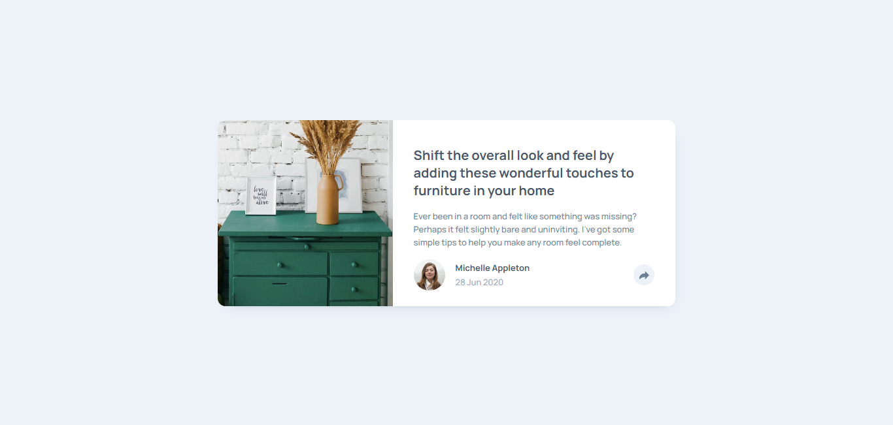

# Frontend Mentor - Article preview component solution

This is a solution to the [Article preview component challenge on Frontend Mentor](https://www.frontendmentor.io/challenges/article-preview-component-dYBN_pYFT). Frontend Mentor challenges help you improve your coding skills by building realistic projects. 

## Table of contents

- [Frontend Mentor - Article preview component solution](#frontend-mentor---article-preview-component-solution)
  - [Table of contents](#table-of-contents)
  - [Overview](#overview)
    - [The challenge](#the-challenge)
    - [Screenshot](#screenshot)
    - [Links](#links)
  - [My process](#my-process)
    - [Built with](#built-with)
    - [What I learned](#what-i-learned)
    - [Continued development](#continued-development)
    - [Useful resources](#useful-resources)
  - [Author](#author)

## Overview

### The challenge

Users should be able to:

- View the optimal layout for the component depending on their device's screen size
- See the social media share links when they click the share icon

### Screenshot



### Links

- Solution URL: [GitHub](https://github.com/lemartinezm/article-preview-component)
- Live Site URL: [Vercel](https://article-preview-component-eight-omega.vercel.app/)

## My process

### Built with

- Semantic HTML5 markup
- CSS custom properties
- Flexbox
- SASS/SCSS
- Mobile-first workflow
- Vanilla JavaScript

### What I learned

* querySelector

```js
document.querySelector('#share-button svg path').style.fill = 'white';
```

* matchMedia
```js
const mediaMobile = window.matchMedia('(max-width: 767px)');
```

### Continued development

- Semantic HTML5 markup
- SASS/SCSS
- JavaScript

### Useful resources

- [querySelector](https://developer.mozilla.org/en-US/docs/Web/API/Document/querySelector) - This helped me for querySelectors.
- [matchMedia](https://developer.mozilla.org/en-US/docs/Web/API/Window/matchMedia) - This helped me for matchMedia.

## Author

- Frontend Mentor - [@lemartinezm](https://www.frontendmentor.io/profile/lemartinezm)
- LinkedIn - [lemartinezm](https://www.linkedin.com/in/lemartinezm)
- Twitter - [@Luis14151617](https://twitter.com/Luis14151617)
